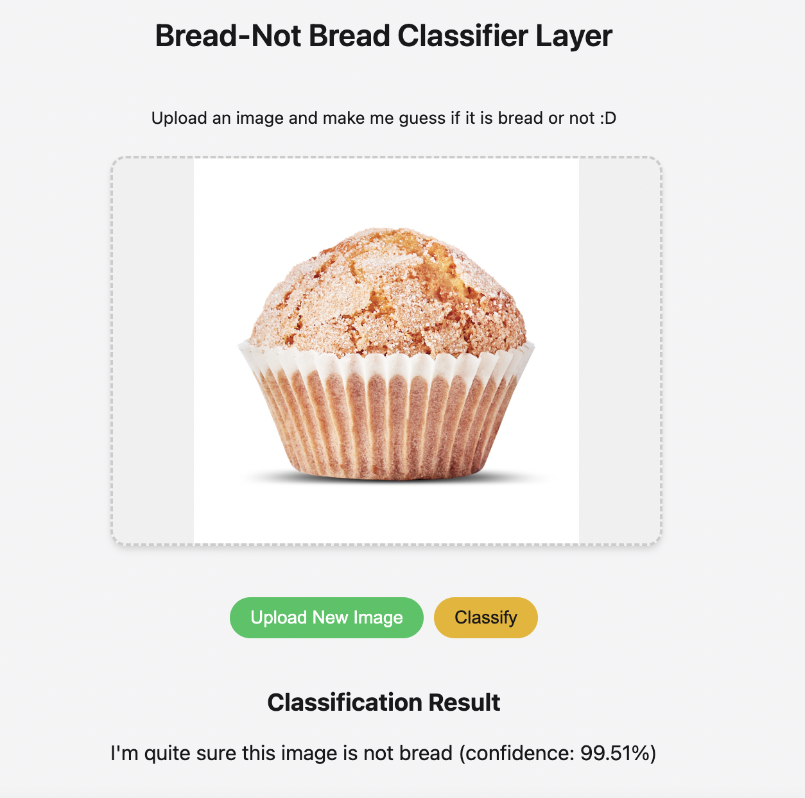
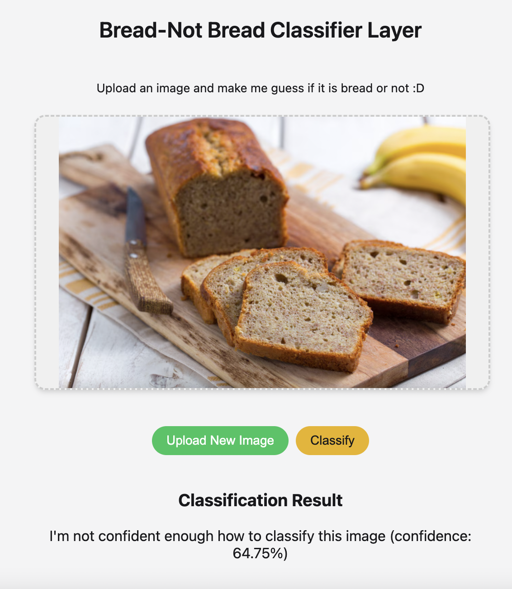

## **YOLO MODEL DEPLOYMENT -FAILS IN SINGLE IMAGE PREDICTIONS-:**
  * [Yolo11n.pt public Streamlit App](https://gourmetfoodclassifierv12.streamlit.app/)
  * It for instance classifies a lemon as bread with a 40% confindence.
    

## **BETTER TRY CLIP DEPLOYMENT -WORKS WELL ENOUGH -0,90 ACC.- WITH SINGLE IMAGE PREDICTIONS:**
   * **[Eat Blindly v.1 Repository (Bread-Not bread Classifier App)](https://github.com/4GeeksAcademy/finalprojectdeploymentDianaM)** deployed using Flask in a temporary port url
     that needs to be launched from the open codespace of the repository. In this case and despite being able to convert CLIP Model to onnix to force compatibility with Streamlit, the
     onnx file is 5 times heavier than the max size allowed by Github (100MB) so it hadn't been possible to deploy the app publicly in Streamlit nor Flask.
   * [OPEN AI CLIP temporary and variable url port](https://laughing-sniffle-4jg966gw9vvp2j5vj-8000.app.github.dev/)
   * It is set to classify bread and not_bread images above a confidence level of 0,69, below what is not sure enough and thus the image wouldn't pass to the next layer (gourmet level
     bread or not) until further phases after improving performance metrics

  

  
  
   
